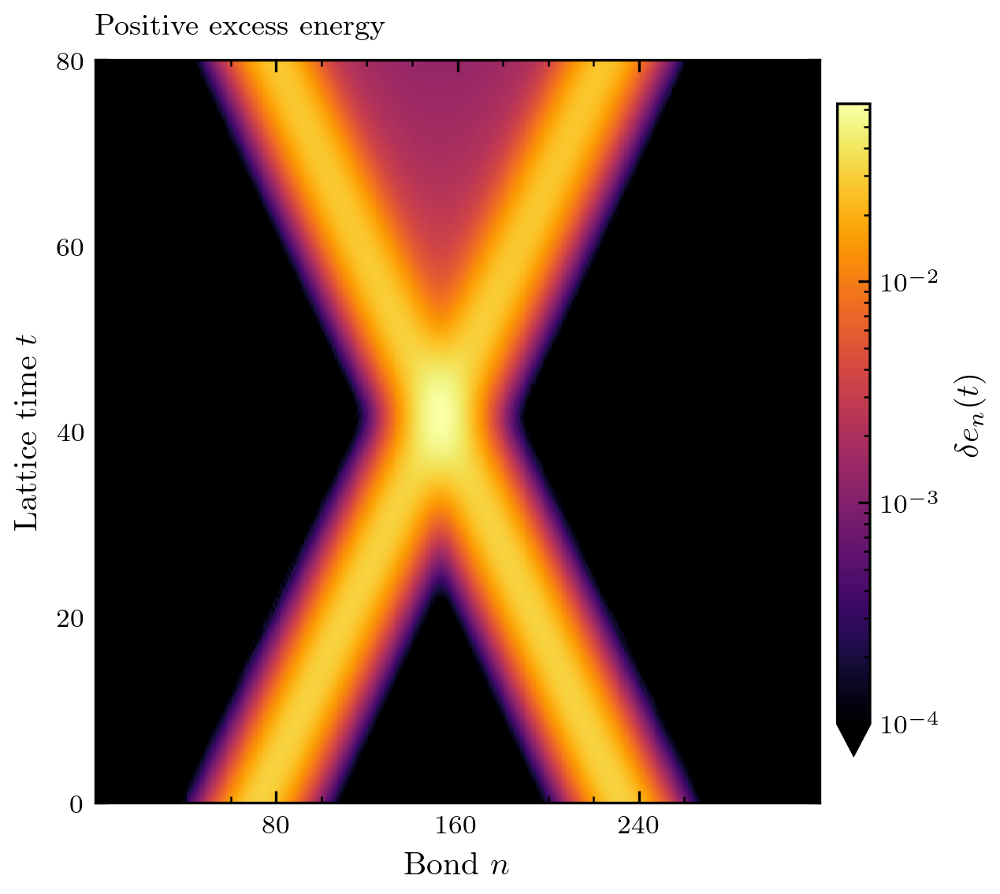
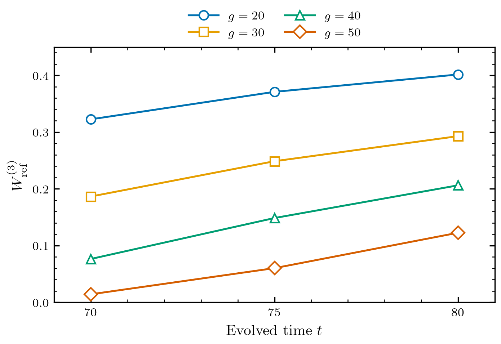
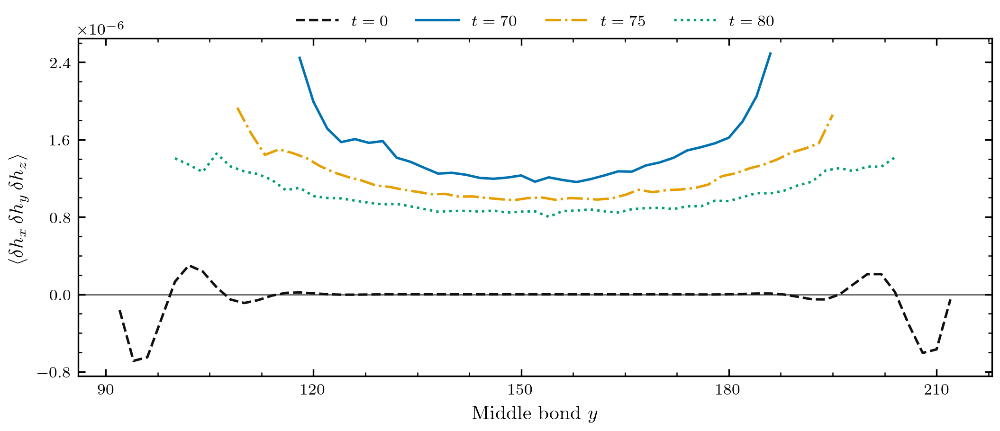

# IFT

Two packets of the lightest Ising particle approach one another, collide,
and leave energy between the two main outgoing packets. This example shows
the evolution and the overlaps calculated from its saved MPS states. It
also includes a separate calculation of the particle masses, which helps
identify the outgoing channels that the collision can reach.

The Hamiltonian is

```math
H=-\sum_n\left(\sigma_n^z\sigma_{n+1}^z
 +1.06\,\sigma_n^x+0.006\,\sigma_n^z\right),
\qquad J=a=\hbar=1.
```

The [Ising scattering paper](https://arxiv.org/abs/2411.13645) describes the
MPS packet construction and outgoing-state projections used here. The
[Ising theory page](../physics/ising.md) introduces the lattice model and
its relation to the field theory.

## The collision



The colour shows the positive part of the vacuum-subtracted bond energy
``\delta e_n(t)`` on a logarithmic scale starting at ``10^{-4}``. The packets
meet near ``t=42``. After the collision, the two bright outer bands move
apart, while a weaker signal remains between them. The logarithmic scale
makes this interior energy visible alongside the peaks. Negative local
excess energy is possible because the subtraction is relative to the
vacuum, rather than to the lowest eigenvalue of each individual bond
operator. The [signed figure](../assets/ising-collision/energy-signed.pdf)
retains those values.

The finite window has 320 sites, with the same uniform MPS vacuum extending
to infinity on each side. The Gaussian amplitudes are proportional to
``\exp[-(n-n_0)^2/\sigma^2]``. Here ``\sigma=20`` is the width parameter of
the amplitude, not the standard deviation of its squared magnitude.

| Quantity | Value |
| --- | --- |
| Packet centres | 80 and 240 |
| Central momenta | ``+0.38`` and ``-0.38`` |
| Gaussian amplitude width ``\sigma`` | 20 |
| Vacuum bond dimension | 8 |
| Maximum evolution bond dimension | 24 |
| Time step | 0.1 |
| Final evolved time | 80 |
| Saved MPS times | ``0,5,10,\ldots,80`` |
| Vacuum correlation length | 6.79 sites |

At ``t=80``, bonds 120 through 190 contain about ``6.35\%`` of the total
excess energy. This is an energy fraction; converting it into a particle
probability would require knowing the energy and spatial profile of each
outgoing component. The expectation-value plot includes all components of
the quantum state, so counting its bands does not count the particles in a
single outcome.

## The particle masses

The incoming central energy is ``2E_1(0.38)\simeq1.6380``. To identify
which species can appear after the collision, the uniform-vacuum and
excitation calculations were repeated at larger bond dimensions ``D``.
The table gives the two lowest rest energies above each vacuum.

| ``D`` | ``m_1`` | ``m_2`` | ``2m_1-m_2`` |
| --- | --- | --- | --- |
| 16 | 0.254846 | 0.505977 | 0.003715 |
| 24 | 0.254845 | 0.500243 | 0.009448 |
| 32 | 0.254845 | 0.499486 | 0.010205 |
| 48 | 0.254845 | 0.498518 | 0.011173 |
| 64 | 0.254845 | 0.498326 | 0.011365 |

The heavier state lies below the rest energy of two light particles. It
therefore cannot decay into two of them while conserving energy and
momentum. Its mass changes by ``0.000192`` between ``D=48`` and ``D=64``,
or about ``0.04\%``. The same change is about ``1.7\%`` of the binding
energy ``2m_1-m_2``, so the binding energy is more sensitive to ``D`` than
the mass. These successive-dimension differences are comparisons, rather
than error bars on the limiting values.

The two-species spectrum agrees with the regime described in
[Appendix A of the paper](https://arxiv.org/html/2411.13645v1#A1).
The available energy permits channels such as ``11\to12``, ``11\to22``,
and ``11\to111``. The first two create heavier particles while retaining
two outgoing particles; the last increases their number. Conservation of
energy and momentum restricts their momenta, but does not fix their
probabilities.

These larger-``D`` vacua belong to the spectrum calculation. The collision
above still uses its ``D=8`` vacuum. The light-particle energy at incoming
momentum changes by only about ``0.004\%`` from ``D=8`` to ``D=64``, while
the heavier state needs the larger variational space to fall below the
two-light-particle threshold. Projecting the saved collision onto that
heavier species requires an excitation construction compatible with its
vacuum and boundary tensors.

## Overlaps after the collision

The two-light-particle calculation includes the momentum dependence of the
excitation tensors. At ``t=80``, its outgoing weight is ``0.259713`` with
at least 80 sites between the two insertions. The same calculation recovers
``0.998331`` of the incoming state; dividing by that incoming value gives
``0.260147``. Reducing the final-state separation to 60 sites changes this
ratio to ``0.260182``.

There is also a substantial overlap with states containing three ordered
light-particle insertions. For this calculation the excitation tensors are
held at reference momenta ``(-\pi/10,0,+\pi/10)``. Their excitation energies
sum to ``1.6411``, close to the incoming central energy. The insertion
positions vary across the window, with both neighbouring distances at
least ``g``. The weight is

```math
W_{\rm ref}^{(3)}(t;g)=
\frac{\sum_{n,r}b_{n,r}^{\dagger}G_{r-n}^{+}b_{n,r}}
{\langle\psi(t)|\psi(t)\rangle},
```

where ``b_{n,r}`` contains the overlaps at the allowed middle positions,
and ``G_{r-n}`` is their Gram matrix. The
[projection page](../physics/particle-production.md) explains why this
matrix is needed.



Each curve uses a different minimum distance ``g`` between neighbouring
insertions. The plotted points are the saved states at ``t=70,75,80``;
the lines join those measurements. At ``g=40``, the weight grows from
``5.64\times10^{-6}`` in the initial state to ``0.20626`` at ``t=80``.
At the final time it ranges from ``0.40158`` for ``g=20`` to ``0.12268``
for ``g=50``.

This growth, together with the momentum support near zero total momentum,
provides evidence for an outgoing three-particle component. At ``t=80``
and ``g=40``, ``96.65\%`` of the weight on the selected Fourier grid has
``|p_1+p_2+p_3|<0.15``. Its total-momentum standard deviation is ``0.0697``,
close to the incoming Gaussian estimate ``\sqrt{2}/\sigma=0.0707``.
A separate check projects localized outgoing
light-particle pairs onto the same triple references. Across the tested
outer separations, their largest weight is ``1.58\times10^{-6}`` at
``g=40``. This checks contamination from those chosen pairs; it does not
bound contamination from every possible two-particle state.

The numbers
above measure the specified reference subspace. Obtaining the full
``111`` probability requires the momentum dependence of all three tensors
and separation from the other channels. The visible time and
separation dependence also shows that ``t=80`` is too early to read off a
final channel probability from these curves. Two particles with similar
velocities can remain close long after the collision, and increasing
``g`` removes their contribution along with nearby interacting states.

## Energy correlations

The saved MPS also allows a comparison of energy at three separated bonds.
With ``\delta h_n=h_{n,n+1}-\langle h_{n,n+1}\rangle_{\rm vac}I``, the
following figure shows ``\langle\delta h_x\delta h_y\delta h_z\rangle``.
The outer bonds ``x,z`` are placed at the two energy peaks at each time,
and the middle bond ``y`` is varied between them. The outer pairs are
``(72,232)``, ``(98,206)``, ``(89,216)``, and ``(80,225)`` at
``t=0,70,75,80``, respectively.



The initial curve is close to zero in the middle of the window. After the
collision, the three-point expectation is positive throughout that region.
For example, at ``t=80`` and bonds ``(80,160,225)``, it is
``8.78\times10^{-7}``; the vacuum value is below ``5\times10^{-18}`` in
magnitude. Subtracting the products of one- and two-point expectations
gives a connected third cumulant of ``1.05\times10^{-8}``. These
correlations compare energy in the outer and interior regions together.

## Running the calculation

After [installing the Julia environment](../running.md), you can run the
same collision parameters from the repository directory with

```sh
julia --project=simulations simulations/models/ift/scripts/collide_fixed_momentum.jl \
  --bond_dimension 8 --evolution_bond_dimension 24 \
  --length 320 --n_center 80 --kappa 0.38 --sigma 20 \
  --h_x 1.06 --h_z 0.006 --time_step 0.1 --total_time 801 \
  --save_every 50 --output_dir results/ift/collision-320
```

`--total_time 801` counts the initial row and 800 evolution steps, giving
``t_{\rm final}=80``. The saved states are in a new subdirectory under
`results/ift/collision-320/states/`. The run shown here used Julia 1.12.6,
two Julia threads, one BLAS thread, and random seed 20260924. It took about
two hours on the machine used for this example. Compilation, processor,
memory, and package versions affect that time. The command above uses a
new random initialization; the [settings file](../assets/ising-collision/run-settings.toml)
records the parameters of the displayed run.

The mass comparison can be repeated separately with

```sh
julia --project=simulations simulations/models/ift/scripts/bound_state_spectrum.jl \
  --gx 1.06 --gz 0.006 --bond-dimensions 16 24 32 48 64 \
  --rest-only --output-dir results/ift/spectra
```

To calculate a three-reference weight, start Julia with
`julia --project=simulations` from the repository directory. Set
`state_path` to one of your saved MPS files, then run

```julia
using LinearAlgebra, MPSKit, TensorKit
scripts = "simulations/models/ift/scripts"
include(joinpath(scripts, "state_io.jl"))
include(joinpath(scripts, "particle_basis.jl"))
include(joinpath(scripts, "three_particle_overlap.jl"))
using .IFTStateIO, .IFTParticleBasis, .IFTThreeParticleOverlap

saved = load_ift_state(state_path)
psi = saved["state"]
vac = saved["reference"]["vacuum"]
ham = saved["reference"]["hamiltonian"]
arrays = vacuum_arrays(vac)
particle_tensors = excitation_tensors(vac, ham, [-pi/10, 0.0, pi/10])
BL, BM, BR = particle_tensors.left[1,1], particle_tensors.left[2,1], particle_tensors.right[3,1]
L, g = length(psi), 40
ket = [ComplexF64.(convert(Array, n == 1 ? psi.AC[n] : psi.AR[n])) for n in 1:L]
blocks = three_particle_overlaps(ket, arrays.AL, arrays.AR, arrays.Cinv,
                                 BL, BM, BR; minimum_separation=g)
grams = Dict(span => middle_position_gram(arrays.AL, arrays.Cinv, BL, BM, BR,
                    span; middle_offsets=g:span-g) for span in 2g:L-1)
projection = three_particle_weight(blocks, grams, real(dot(psi, psi));
    minimum_separation=g, gram_minimum_separation=g)
println(projection)
```

Repeat this calculation for the initial state and several late states to
compare their weights. The [function reference](../reference/programs.md)
describes the returned Gram eigenvalues and the overlap between pair and
triple reference states.

## Numerical comparisons still needed

The evolved squared norm changes from one to ``0.995674``, and the summed
excess energy decreases by about ``0.262\%``. Every overlap reported here
is divided by the saved state's squared norm. That removes an overall
normalization factor, but it cannot restore components lost during MPS
truncation. The evolution reaches its bond-dimension limit of 24 on most
bonds. Repeating the evolution at a larger bond dimension will show how
much the overlaps change when more entanglement is retained.
The time step and outgoing separation time also need to be varied before
quoting final channel probabilities.

The figures and small numerical tables are included with the website;
the full saved MPS files remain in the local results directory. You can
download the [three-reference weights](../assets/ising-collision/three_reference_weights.csv),
[energy correlations](../assets/ising-collision/three_energy_selected.csv),
and spectrum tables for [dimensions 16–32](../assets/ising-collision/spectrum-16-32.csv)
and [48–64](../assets/ising-collision/spectrum-48-64.csv).
The [pair–triple overlap checks](../assets/ising-collision/pair-triple-checks.csv)
and [momentum-support measurements](../assets/ising-collision/momentum-support.csv)
are also available. In the latter table, the initial outgoing-grid weight
is negligible, so its normalized momentum and energy moments have no useful
physical interpretation.
[`plot_overlaps.py`](../assets/ising-collision/plot_overlaps.py) redraws the
two overlap and correlation figures from their adjacent CSV files. Run it
with Python, NumPy, and Matplotlib installed; it uses LaTeX by default, or
Matplotlib's mathematical lettering with `--no-tex`.
